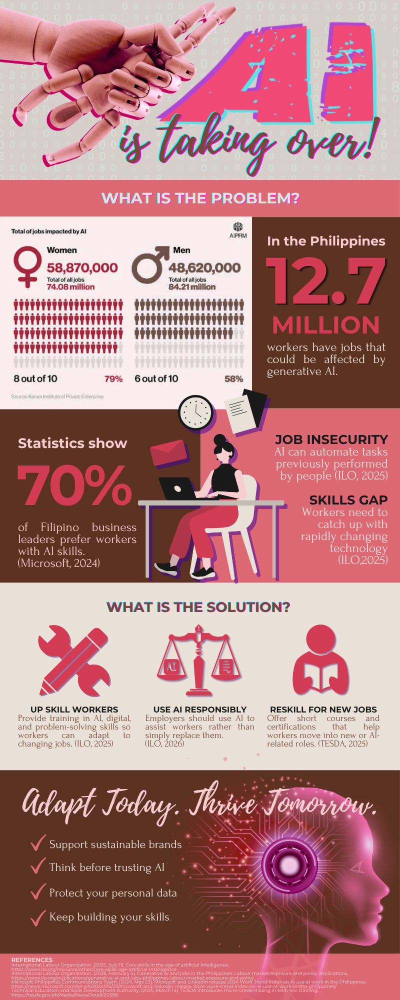

# 📱 ACTIVITY 3: SOCIAL MEDIA INFOGRAPHICS & PROJECT DOCUMENTATION 🌸

---

## 🎀 🦋 Activity Overview 🦋 🎀

> *✨ Visual Communication, Problem Infographics & Technology Solutions ✨*
> 
> 🌸 This activity features a one-page problem infographic paired with comprehensive project documentation. It focuses on communicating complex information visually and proposing an effective technology solution. 🌷

---

## 🎨 Deliverables & Outputs

### 📱 Social Media Infographic

 

### 📄 Project Documentation

<!-- Updated PDF button with pastel purple color scheme -->

  

---

  ✨ Patience, Progress, and Purpose for GE 4120 | © 2026 Princess Hannah Bea Maramara ✨

